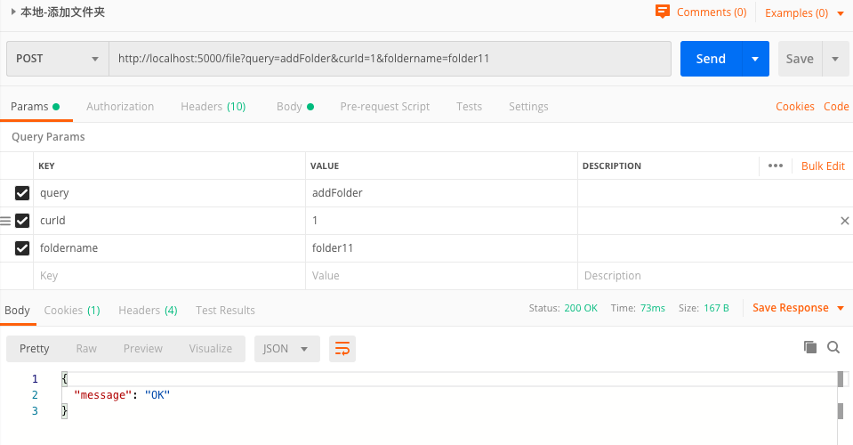
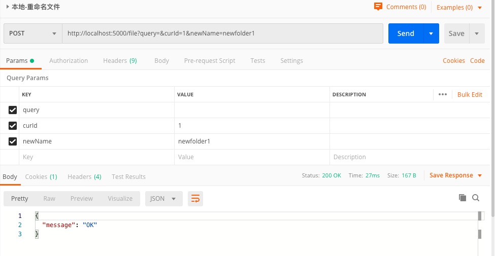
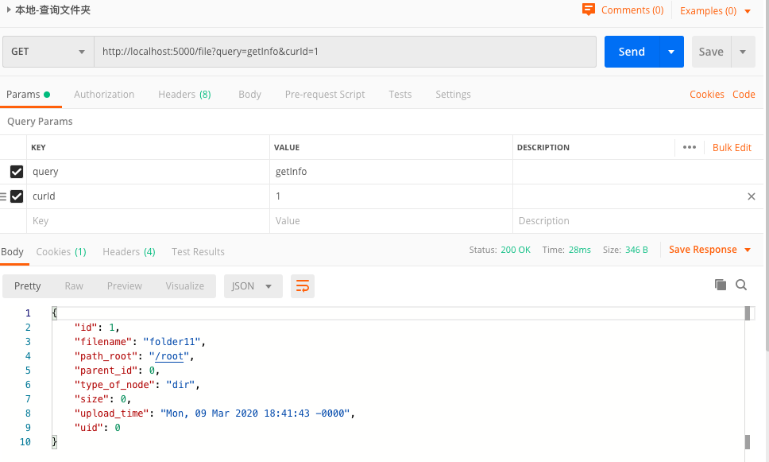

[TOC]

# 文档

## 数据库设计

在设计数据库时，并不是通过维护一个嵌套的对象，而是将所有的数据都放入到一维数组，父子关系通过`parId`字段来维护，根目录到当前所在目录通过`path_root`字段来维护。只考虑相邻的两级关系，不考虑所有的层级关系，优势如下：

1. 存入数据时，只需要将`parent_id`设为当前目录的Id，`path_root`设为根目录到当前目录的路径。而不是通过递归对象将数据放到对应的节点上。
2. 修改当前文件或者目录名称时，只需要根据当前数据的Id去数据库匹配然后修改。如果修改的是目录名称(假如nameA修改为nameB)，会影响该目录下所有子目录和子文件的`path_root`字段，那么只需要匹配所有满足`path_root`字段里面包含nameA的数据，然后替换成nameB就可以了。
3. 移动文件或目录时，所有的子目录或者文件也会跟着变化。修改当前文件或目录的`parent_id`字段，指向新的目录Id，同样也要修改所有子目录或者子文件的`path_root`字段，同上。
4. 删除文件或目录时，根据当前的Id去数据库匹配删除。如果删除的目录里面有子目录或者文件(假如删除的是目录folderA)，那么只需要匹配所有满足`path_root`字段里面包含folderA的数据，然后全部删除。最后记得也要删除磁盘文件，不然内存消耗太大(如果有回收站保留30天，则设置最后保留时间，超时后再去删磁盘文件)。


UserTable

|               |              |        |
| ------------- | ------------ | ------ |
| uid           | 用户ID       | 默认 0 |
| email         | 邮箱         |        |
| password_hash | 密码的hash值 |        |

FileNode

|               |                          |                                        |
| ------------- | ------------------------ | -------------------------------------- |
| id            | 唯一id                   | 主键                                   |
| filename      | 文件名                   |                                        |
| path_root     | 从根目录到当前目录到路径 | ‘/’ 分割                               |
| parent_id     | 父目录id                 |                                        |
| type_of_node  | 类型                     | （dir , .py , .csv ） 'dir' 表示是目录 |
| size          | 大小                     |                                        |
| upload_time   | 上传时间                 |                                        |
| user_id       | 所属用户                 | 外键，默认0                            |
| hdfs_path     |                          |                                        |
| hdfs_filename |                          |                                        |


## api设计


### 文件相关

##### POST

* 上传文件

  * query = ‘upload'
  * 一个文件

* 添加文件夹

  * query='addFolder'

  * curId  // 当前目录的id （用来设置为新文件夹的parent_id）

  * foldername //新建文件夹的名字

    

* 改名：

  * query = 'rename'

  * curId //需要改名的文件ID

  * newName // 新名字

    

##### GET

* 获取文件信息

  * query == 'getInfo'

  * curId //要获取的文件的id

    

* 获取当前用户的所有文件

  * query == 'getAll'

* 删除：

  * query == 'delete'
  * curId // 需要删除的文件（或目录） 的ID


## RESTful

```js
//const Api = {
    //BASE_API :'http://localhost:5000',
    //...
    // //获取所有文件夹
    // // eg. curl http://localhost:5000/folders/  
    // getFolders() {
    //     return fetch(this.BASE_API + "/folders", {
    //         method: 'GET',
    //         headers: {
    //             'Accept': 'application/json',
    //         },
    //     });
    // },
    
    // 添加文件夹
    // selected_folder_id 当前选中目录 默认为 0（根目录）
    // eg. curl -X POST -H "content-type: application/json" --data '{"name": "111","selected_folder_id":0}' http://localhost:5000/folders
```
