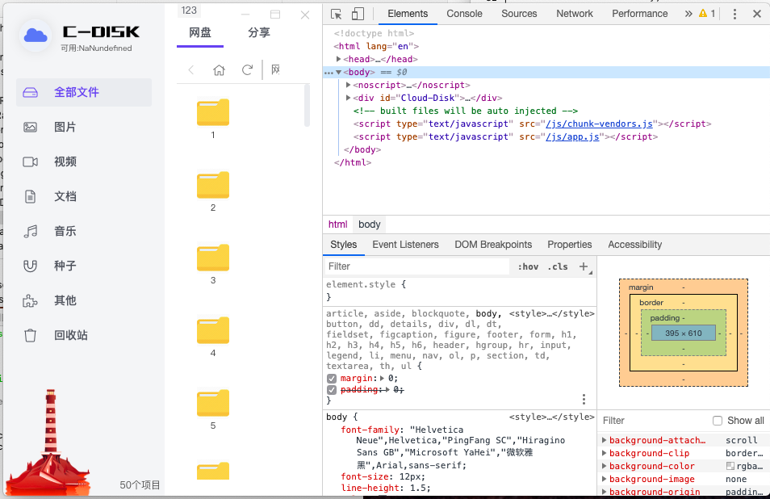
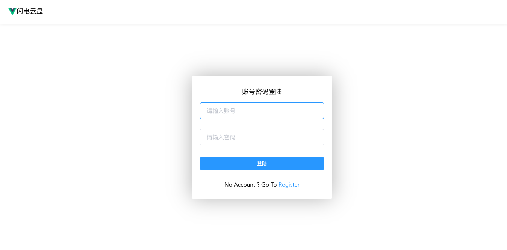
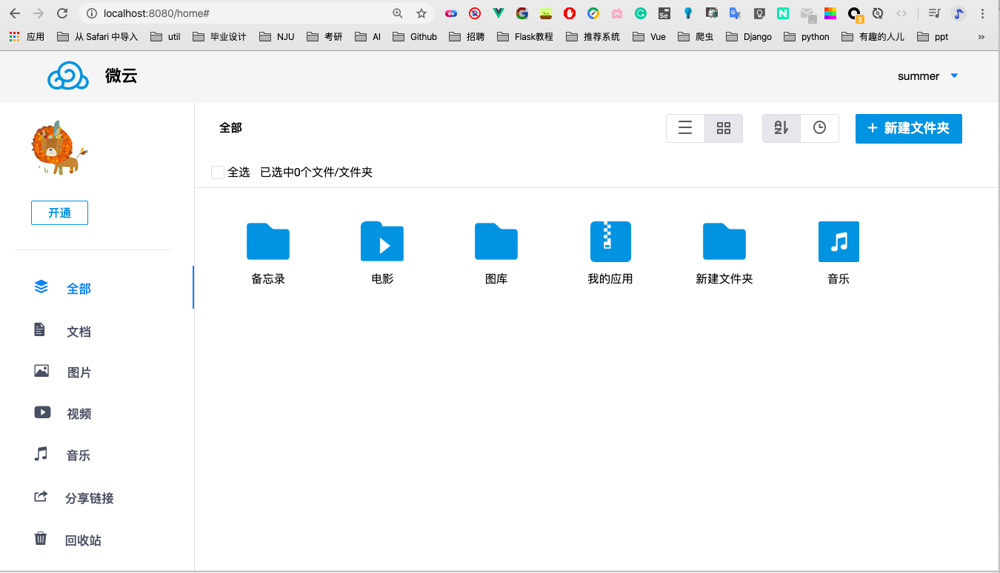
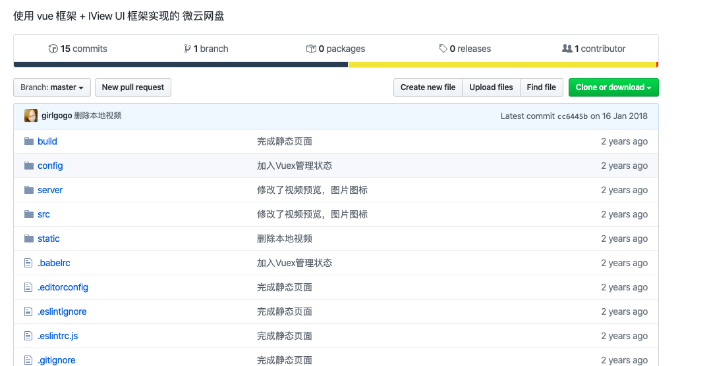
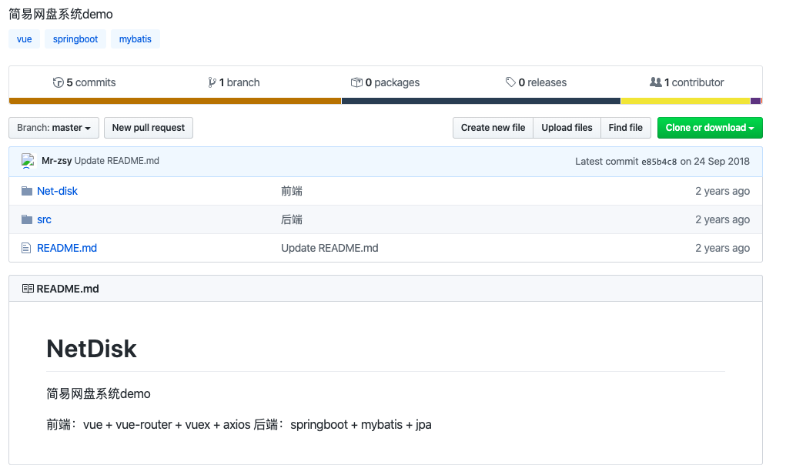
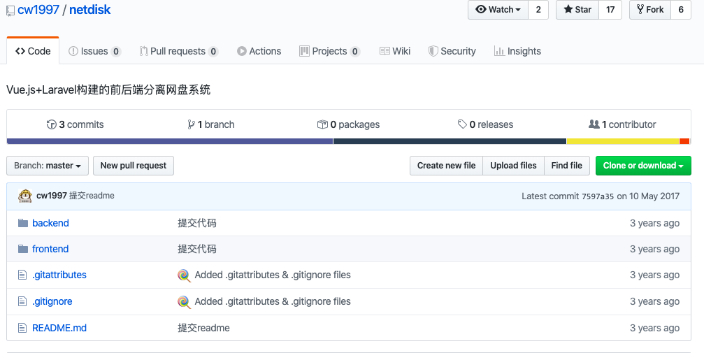

* 2.26 
  1. 在服务器安装 Hadoop 和 hdfs
  2. 在服务器上用python连接hdfs，并上传文件到hdfs
* 3.6 添加用户注册登录api

## 待办

*  ⚠️重构数据库
*  部署flask程序到服务器
* 将sqlite改为mysql
* vue开发前端 

## 资料 

##### vue相关

* [vue+nodejs+express+mysql 建立一个在线网盘程序](https://www.cnblogs.com/yejingping/p/10436522.html)

* [C-Disk](https://github.com/zjinh/CloudDisk)

* [本人2019届毕业设计作品《企业级网盘分布式系统》，被评为优秀毕业设计。本系统通过SpringBoot+Hadoop+Vue进行整合。](https://github.com/chenxingxing6/cxx-graduation)

* [SkyDrive -- Vue全家桶 + Koa实现的在线云盘](https://github.com/hcLei/skydrive)

  http://lhccloud.cn/

  

* [使用 vue 框架 + IView UI 框架实现的 微云网盘](https://github.com/girlgogo/yunpan-vue)

* [简易网盘系统demo](https://github.com/Mr-zsy/NetDisk)

  

* [Vue.js+Laravel构建的前后端分离网盘系统](https://github.com/cw1997/netdisk)

  

